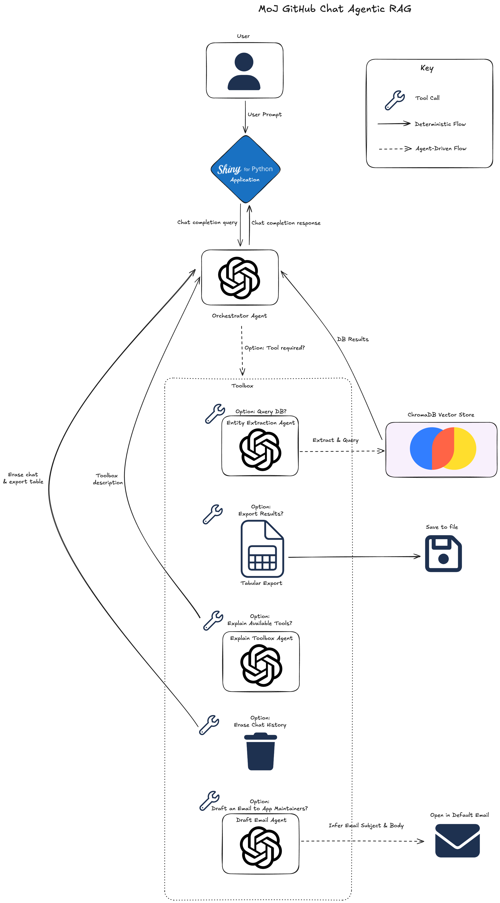

<!-- Badges start -->

<!-- Badges end -->

# GitHub Chat

## Demonstrating Semantic Search With MoJ GitHub Repo Metadata.

### Data

This project uses public repository metadata from the GitHub organisations 
[ministryofjustice](https://github.com/ministryofjustice) and
[moj-analytical-services](https://github.com/moj-analytical-services).

Public data for the app lives in this
[GitHub repo](https://github.com/ministryofjustice/github-chat-data). Note
that on raising a PR or creating a tag release in this repo, an automated
deployment will be initiated. This uses the data stored in the
`github-chat-data` repo (head commit) to deploy to shinyapps.io.

* Pull Request -> Deploys to development.
* Tag release -> Deploys to live. 

### Application

This is a basic
[Shiny for Python](https://shiny.posit.co/py/api/core/ui.chat_ui.html)
application allowing a user to perform semantic search with content from
Ministry of Justice GitHub repos.

The live version of the app lives at https://richleysh84.shinyapps.io/moj-github-chat/ .

The development version of the app lives at https://richleysh84.shinyapps.io/moj-github-chat-dev/ .

### Agentic RAG

This application uses
[structured model output](https://openai.com/index/introducing-structured-outputs-in-the-api/)
to determine whether the agent should use a tool or simply respond to the
user. If the Orchestrator Agent determines that a tool should be used,
directives within the application code are executed. This potentially
involves the use of additional agents dedicated to a specific tool, such as
the Entity Extraction Agent in the above example. Here's a good
[primer on tool calling](https://posit-dev.github.io/chatlas/tool-calling.html).

### Contributing

Please refer to the [developer guidance](./CONTRIBUTING.md).
